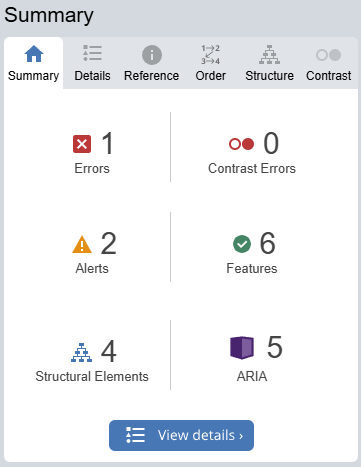

# Informe Sobre Accesibilidad
Este informe contendrá diferentes apartados relacionados con la investigación de la accesibilidad y su desarrollo a lo largo del proyecto.

# Índice
- [Accesibilidad Web: Importancia, Beneficios y Normativas](#accesibilidad-web-importancia-beneficios-y-normativas)
    - [Importancia del Diseño Web Accesible](#importancia-del-dieseño-web-accesible)
    - [Beneficios para los Usuarios y Desarrolladores](#beneficios-para-los-usuarios-y-desarrolladores)
    - [Normativas Vigentes](#normativas-vigentes)
    - [Accesibilidad y Experiencia de Usuario (UX)](#accesibilidad-y-experiencia-de-usuario-ux)
    - [Conclusión](#conclusión)
- [Análisis Inicial de Accesibilidad en Documentos Web](#análisis-inicial-de-accesibilidad-en-documentos-web)
    - [Objetivo](#objetivo)
    - [Análisis de Accesibilidad](#análisis-de-accesibilidad)
        - [Problemas detectados](#problemas-detectados)
        - [Puntos a favor](#puntos-a-favor)
    - [Deducción](#deducción)
- [Análisis de Principios, Pautas y Niveles de Conformidad](#análisis-de-principios-pautas-y-niveles-de-conformidad)
    - [Descripción de los principios fundamentales de la WCAG 2.1](#descripción-de-los-principios-fundamentales-de-la-wcag-21)
    - [Nivel de conformidad objetivo](#nivel-de-conformidad-objetivo)
    - [Ejemplos prácticos para la aplicación de las pautas](#ejemplos-prácticos-para-la-aplicación-de-las-pautas)
- [Análisis y priorización de errores según puntos de verificación](#análisis-y-priorización-de-errores-según-puntos-de-verificación)
    - [Errores detectados](#errores-detectados)
    - [Mejores soluciones](#mejores-soluciones)
- [Implementación para alcanzar el nivel deseado](#implementación-para-alcanzar-el-nivel-deseado)
- [Verificación mediante test externos](#verificación-mediante-test-externos)
    - [Pruebas automáticas](#pruebas-automáticas)
    - [Pruebas manuales](#pruebas-manuales)
- [Verificación multiplataforma](#verficación-multiplataforma)
- [Análisis y estrategias para mejorar visibilidad en buscadores](#análisis-y-estrategias-para-mejorar-visibilidad-en-buscadores)
###
# Accesibilidad Web: Importancia, Beneficios y Normativas

## Importancia del Dieseño Web Accesible
El diseño accesible en una web es fundamental para garantizar que todas las personas puedan acceder a ella y utilizarla sin limitaciones. La accesibilidad web no es solo por la ética o la inclusión social, además es un requisito legal en muchos países.

Las organizaciones pueden llegar a más usuarios si facilitan el acceso a el contenido.

## Beneficios para los Usuarios y Desarrolladores
Los beneficios no afectan solo a los usuarios.
- **Usuarios con discapacidad:** Personas con discapacidad visual, auditiva, cognitiva o motriz pueden navegar eficientemente por la web si estos son accesibles. Incluyendo lectores de pantalla, compatibilidad con teclados, contenido claramente estructurado y subtitulos en videos.

- **Usuarios en genereal:** El diseño accesible mejora la navegación de todos, ya que hay usuarios sin discapacidad pero con otras dificultades como personas de edad avanzada o con limitaciones de internet.

- **Desarrolladores y empresas:** Tener buenas prácticas de accesibilidad mejora el SEO, facilita el mantenimiento y reduce la necesidad de diseños costosos. Además el cumplimiento de la normativa evita posibles sanciones legales.

## Normativas Vigentes
El diseño accesible tiene diferentes reglas a nivel nacional e internacional:
- **WCAG 2.1(Web Content Accesibility Guidelines):** Están desarrolladas por el W3C, estas pautas se basan en cuatro pilares: perceptible, operable, comprensible, obsoleto.
- **Real Decreto 1112/2018:** esta establece la obligación de accesibilidad digital en el sector público y ciertos organismos privados. Este decreto es la base de la legislación es España, a día de hoy esta aprobado el Real Decreto 193/2023 que entrará en vigor en 2029.

Cumplir estas normativas no solo garantiza el acceso equitativo a la información, si no que también protege a las organizaciones de posibles problemas por incumplimiento.

## Accesibilidad y Experiencia de Usuario (UX)
La accesibilidad y la UX están estrechamente relacionadas, ya que un diseño accesible mejora la experiencia de todos los usuarios, un entorno adecuado mejora la experiencia de todos los usuarios gracias a la incorporación de la navegación intuitiva, contrastes adecuados y compatibilidad con tecnologías de asistencia.

## Conclusión
Inveritr en accesibilidad web es una estrategia que fomenta la inclusión digital y garantiza una mejor experiencia de usuario. Obviamente además de ser una responsabilidad social, beneficia a las empresas aumentando su alcance, mejora su reputación y asegura el cumplimiento normativo.

# Análisis Inicial de Accesibilidad en Documentos Web
## Objetivo 
Identificar problemas de accesibilidad en páginas web existentes o en partes del proyecto asignado.

## Análisis de Accesibilidad
La página analizada a continuación es el formulario de inicio de sesión de nuestro proyecto: [Enlace a inicio de sesión](https://shortener.lestro.top/login)

Herramientas utilizadas: WAVE, Lighthouse, Pruebas manuales.

### Problemas detectados
1. **Errores de contraste** 
    - **Ubicación:** Botones del header de inicio de sesión y registro.
    - **Impacto:** Usuarios con baja visión pueden tener problemas para leer el contenido del botón.
    - **Solución propuesta:** Aumentar el contraste entre el texto y el fondo para cumplir el criterio AA de WCAG 2.1.

2. **Botón vacío:** 
    - **Ubicación:** Botón de cambio a modo oscuro en el header.
    - **Aclaración:** Realmente el botón no está vacío, contiene un icono para el cambio de tema, pero al ser de una extensión probablemente no es detectado correctamente por los analizadores.

3. **Rotura de la referencia del ARIA:**
    - **Ubicación:** En los campos del formulario de inicio de sesión.
    - **Impacto:** Los lectores de pantalla no darán la información necesaria a los usuarios con problemas de visión.
    - **Solución propuesta:** Enlazar correctamente los ARIA a los elementos del formulario.

### Puntos a favor
Respecto a las prubas manuales, todas han funcionado correctamente, la página seleccionada es completamente manejable sin usar el ratón, las imágenes tienen texto alternativo y a excepción de los botones mencionados anteriormente el contraste de la página está aprobado.

## Deducción
Este análisis ha indentificado varios errores que no se tuvieron en cuenta a la hora de la producción que afectan a la usabilidad del sitio. Implementar las soluciones permitira mejorar la experiencia de usuario y cumplir la normativa vigente.

# Análisis de Principios, Pautas y Niveles de Conformidad
## Descripción de los principios fundamentales de la WCAG 2.1
- **Perceptible:** la información debe ser presentada de manera que los usuarios puedan percibirla, mediante texto alternativo en imágenes, subtitulos en vídeos y contenido adaptable.

- **Operable:** la interfaz debe ser navegable mediante teclado, con tiempos de respuesta adecuados y sin elementos que pueden provocar crisis epilépticas.

- **Comprensible:** la información y la operación de la interfaz deben ser entendibles, con navegación predecible y ayudas para evitar errores en formularios.

- **Robusto:** el contenido debe ser compatible con tecnologías de asistencia y dispositivos diversos, garantizando su correcta interpretación.

## Nivel de conformidad objetivo
- **Nivel A:** requisitos mínimos para accesibilidad básica.
- **Nivel AA:** nivel recomendado para la mayoría de los sitios web y exigido por normativas oficiales.
- **Nivel AAA:** estándar más alto, recomendado para accesibilidad avanzada

El punto a seguir es el nivel AA, ya que es el que rige la legalidad y es suficiente para cumplir los requisitos imprescidibles, mantenerse dentro de la normativa elimina riesgos a la hora de crear una web accesible.

## Ejemplos prácticos para la aplicación de las pautas
- **Uso de texto alternativo:** todas las imágenes significativas deben tener un atributo "alt" descriptivo.
- **Navegación por teclado:** asegurar que los elementos interactivos sean accesibles mediante el tabulador y el enter sin disponer de un ratón.
- **Contraste de color adecuado:** garantizar al menos un contraste de 4,5:1 entre el texto y el fondo.
- **Etiquetas y descripciones en el formulario:** usar etiquetas "label" asociadas correctamente a los campos de entrada con "for" y "id".
- **Evitar contenido que cause convulsiones:** no incluir elementos que parpadeen más de tres veces por segundo.
- **Ofrecer alternativas a los CAPTCHA:** como preguntas de seguridad en lugar de imágenes complejas.

# Análisis y priorización de errores según puntos de verificación
## Errores detectados
- Errores de contraste con botones.
- Error de enlazado incorrecto de ARIAs en formularios.
- Falta de creación de ARIAs necesarios.

## Mejores soluciones
Respecto al contraste, la mejor solución será comprobar combinaciones de colores similares que cumplan el criterio de accesibilidad AA de contraste para mejorar la visibilidad pero sin modificar la estética de la página.Además para solucionar los problemas de ARIA la forma correcta de solucionarlo es consultar individualmente los campos que requieran de este elemento y corregirlos o simplemente añadirlos. La solución mas sencilla es la relacionada a la falta de etiquetas descriptivas, simplemente añadirlas en lugares necesarios pero sin excederse.


# Implementación para alcanzar el nivel deseado
En este punto se implementarán los cambios necesarios para adecuar la web a los criterios AA de la WCAG 2.1, se plasmarán en este informe mediante capturas comparativas de ciertas partes del código, ya que mostrar todos y cada uno de los cambios sería realmente innecesario.

Comenzaré con los errores mostrados anteriormente en el Header y la página del inicio de sesión.

Problemas de contraste entre el texto y el color de fondo en los botones:

**ANTES:**


**DESPUÉS:**


En este caso el cambio es prácticamente imperceptible, ya que simplemente varía ligeramente la tonalidad del blanco del texto a una más brillante.


A continuación se mostrará la resolución a problemas de conexión entre los ARIA

**ANTES:**

```HTML
<h2 className='login__title'>Formulario de Inicio de Sesión</h2>

            <form className='login__form' onSubmit={handleSubmit} aria-labelledby='login-title'>
                <fieldset className='form__fieldset'>
                    <legend className='visually-hidden'>Formulario de Inicio de Sesión<legend>
```

**DESPUÉS:** 

```HTML
 <h2 className='login__title' id='login-title'>Formulario de Inicio de Sesión</h2>

            <form className='login__form' onSubmit={handleSubmit} aria-labelledby='login-title'>
                <fieldset className='form__fieldset'>
                    <legend className='visually-hidden'>Formulario de Inicio de Sesión</legend>
```

Otro error de ARIA mal conectado:

**ANTES:** 

```HTML
<section className="statistics__qr" aria-labelledby="qr-title">
    <h2 id="qr-title" className="qr__title">Código QR</h2>
    {qr ? (
        <div className="qr__generated">
            <QRCodeSVG value={import.meta.env.VITE_DOMAIN + "/" + enlace.code} size={256}/>
        </div>) : 
        (<button
            className="qr__generateButton"
            onClick={handlerGenerateLink}
            aria-describedby="qr-description"
        >
            Generar QR
        </button>)}
    
    {!qr && 
    <p id="qr-description" className="qr__description">Presiona para generar un código QR para este
        enlace</p>}
</section>
```

**DESPUÉS:** 
```HTML
<section className="statistics__qr" aria-labelledby="qr-title">
    <h2 id="qr-title" className="qr__title">Código QR</h2>
    {qr ? (
        <div className="qr__generated">
            <QRCodeSVG value={import.meta.env.VITE_DOMAIN + "/" + enlace.code} size={256}/>
        </div>) : 
        
        (<button
            className="qr__generateButton"
            onClick={handlerGenerateLink}
            aria-describedby="qr-description"
        >
            Generar QR
        </button>)}
    
    {!qr && 
    <p id="qr-description" className="qr__description">Presiona para generar un código QR para este
        enlace</p>}
</section>
```
Ahora el título está vinculado al formulario que era uno de los errores mencionados anteriormente, ya que estaba incompleto.

Estos son los cambios necesarios a lo largo del código, problemas sencillos de relación de campos y el contraste con los botones.

# Verificación mediante test externos
Volveré a realizar los test realizados anteriormente para comprobar que se cumplen los requisitos AA.

## Pruebas automáticas
Respecto a las pruebas automáticas, esta todo en orden:

Los errores en todas las capturas son siempre los 2 mismos, ya que son errores del header a la hora de interpretar el código de React.

- **Home:**


En este caso, el error de contraste realmente no tiene importancia, ya que es el borde de un input en el modo oscuro, que esta puesto a posta para mantener el tamaño del campo pero manteniendo la oscuridad del modo oscuro teniendolo del mismo color del fondo.

-**Login:**



-**Perfil:**


-**Estadísticas:**


## Pruebas manuales
Respecto a las pruebas manuales, el control por teclado es manejable desde el inicio del proyecto

# Verficación multiplataforma
La verificación multiplataforma se ha tenido en cuenta durante todo el proyecto al igual que el tener una aplicación responsive.

La aplicación ha sido probada en Chrome, Safari, Firefox, Microsoft Edge y Opera. En todos los casos funciona de manera correcta a excepción de Safari, esta última tiene un par de problemas que tras investigar con los otros navegadores tienes que ser problema del navegador, ya que un modal en específico de nuestra página sale con un botón desproporcionado en tamaño respecto al que debería tener.

A parte de esto no hay ningún problema con los navegadores ya que se han probado todos durante el desarrollo de la aplicación para evitar problemas de compatibilidad.

# Análisis y estrategias para mejorar visibilidad en buscadores
- **SEO on page:** 
    - Uso de React Helmet:
    

    Este es el ejemplo del uso en el home, esta herramienta ayuda a la visibilidad en la web. Habrá más en las paginas importantes o en las que se puden acceder sin necesidad de registro como son el Inicio de Sesión y el Registro.

    - React Router:
    
    Para tener rutas amigables